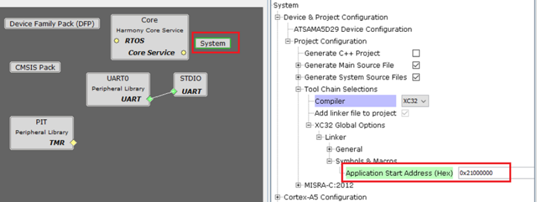
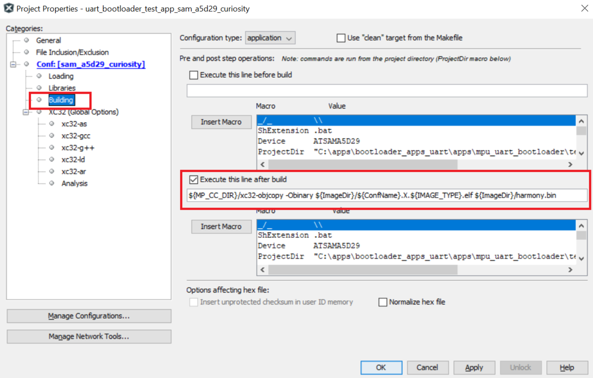

# Configuring an application to be bootloaded for MPUs

**Application settings in MCC system configuration**

1.  Launch MCC for the application project to be configured

2.  Select **system** component from the project graph and configure the below highlighted settings




1.  Specify the Application Start Address:

    -   Specify the Start address from where the application will run under the **Application Start Address \(Hex\)** option in System block in MCC.

    -   As this value will be used by harmony bootloader to Jump to application at device reset it should match the value provided to bootloader code. It should be start address of the cacheable DDR memory.

    -   The **Application Start Address \(Hex\)** will be used in the linker script to place the code at intended address


**MPLAB X Settings**

-   Specifying post build option to automatically generate the binary file from ELF file once the build is complete


```c
${MP_CC_DIR}/xc32-objcopy -Obinary ${ImageDir}/${ConfName}.X.${IMAGE_TYPE}.elf ${ImageDir}/harmony.bin
```



**Parent topic:**[Configuring an Application to be bootloaded](GUID-1533B544-211D-4FA3-A80B-B55B97CB0311.md)

