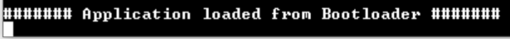

# SAM9X60-Curiosity board: Building and Running the UART Bootloader applications

**Downloading and building the application**

To clone or download this application from Github,go to the [main page of this repository](https://github.com/Microchip-MPLAB-Harmony/bootloader_apps_uart) and then click Clone button to clone this repo or download as zip file. This content can also be download using content manager by following [these instructions](https://github.com/Microchip-MPLAB-Harmony/contentmanager/wiki)

Path of the application within the repository is **apps/mpu\_uart\_bootloader/**

To build the application, refer to the following table and open the project using its IDE.

**Bootloader Application**

|Project Name|Description|
|------------|-----------|
|bootloader\_sd\_emmc/firmware/sam\_9x60\_curiosity.X|MPLABX Project for [SAM9X60-Curiosity board](https://www.microchip.com/en-us/development-tool/EV40E67A)|

**Test Application**

|Project Name|Description|
|------------|-----------|
|test\_app/firmware/sam\_9x60\_curiosity.X|MPLABX Project for [SAM9X60-Curiosity board](https://www.microchip.com/en-us/development-tool/EV40E67A)|

**Setting up [SAM9X60-Curiosity board](https://www.microchip.com/en-us/development-tool/EV40E67A)**

-   Connect the USB port J1 on board to the computer using a micro USB cable \(to power the board\)

-   Connect the J11 on board to the computer using a UART-FTDI cable \(to enable debug com port\)

-   SD Card with FAT32 file system


**Setting up the host script**

-   Refer to [Bootloader Host Script Help](GUID-E9768065-2540-409B-AC12-3DA9417F01F5.md) for setting up the **btl\_host.py** utility used to send the application binary from host PC


**Running the Application**

1.  Open the test application project *test\_app/firmware/sam\_9x60\_curiosity.X* in the IDE

2.  Build the project to generate the *harmony.bin* binary **\(Do not program the binary\)**

3.  Open the bootloader project *bootloader\_sd\_emmc/firmware/sam\_9x60\_curiosity.X* in the IDE

4.  Build the project to generate the *harmony\_bootloader.bin* binary **\(Do not program the binary\)**

5.  Copy the MPU bootstrap loader binary \(*boot.bin*\) from <harmony3\_path\>/bootloader\_apps\_uart/deps/at91bootstrap\_binaries\_sam\_9x60\_curiosity/sd\_card/boot.bin onto the SD Card

6.  Copy the harmony bootloader binary \(*harmony\_bootloader.bin*\) from <harmony3\_path\>/bootloader\_apps\_uart/apps/mpu\_uart\_bootloader/bootloader\_sd\_emmc/firmware/sam\_9x60\_curiosity.X/dist/sam\_9x60\_curiosity/production/harmony\_bootloader.bin onto the SD Card

7.  Insert the SD card into SDMMC0 connector J3 on the board

8.  Reset or Power cycle the device. **GREEN LED** will be turned-on to indicate that harmony bootloader code is running on the target

9.  Run the **btl\_host.py** from command prompt to program the application binary

    ```
     python <harmony3_path>/bootloader/tools/btl_host.py -v -i <COM PORT> -d sam9x6 -f <harmony3_path>/bootloader_apps_uart/apps/mpu_uart_bootloader/test_app/firmware/sam_9x60_curiosity.X/dist/sam_9x60_curiosity/production/harmony.bin
    ```

10. Following snapshot shows output of successfully programming the test application

    -   **Rebooting** and **Reboot Done** messages in below output signifies that bootloading is successful

    

11. If above step is successful then the **GREEN LED** should start blinking

12. Open the Terminal application \(Ex.:Tera Term\) on the computer

13. Configure the serial port settings as follows:

    -   Baud : 115200

    -   Data : 8 Bits

    -   Parity : None

    -   Stop : 1 Bit

    -   Flow Control : None

14. Reset or Power cycle the device

15. **GREEN LED** should start blinking and you should see below output on the console

    

16. **Press and hold** the Switch **USER** and then press Reset button or Power cycle the device to force trigger bootloader at startup

17. Repeat Steps 9-15 once

    -   This step is to verify whether bootloader is triggered by switch press at reset


**Additional Steps \(Optional\)**

-   To bootload any other application refer to [Configuring an application to be bootloaded for MPUs](GUID-57C8A7B4-96A6-423A-B97A-BA730219FFCC.md)


**Parent topic:**[MPU UART Bootloader](GUID-E167DF03-E869-4A4B-B26A-E630383F5654.md)

