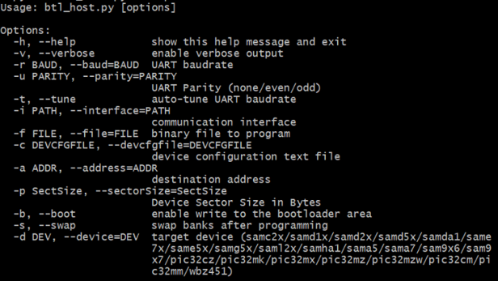

# Bootloader Host Script Help

This document describes the usage of **btl_host.py** host script

Path of the tool in bootloader repository is **tools/btl_host.py**

**Setting up the Host PC**

- The Script is compatible with **Python 3.x** and higher

- It requires pyserial package to communicate with device over UART. Use below command to install the pyserial package

      pip3 install pyserial

**Description**

- This host script should be used to communicate with the Bootloader running on the device via **UART interface**

- It is a command line interface and implements the bootloader protocol required to communicate from host PC

- If size of the input binary file is not aligned to device erase boundary it appends 0xFF to the binary to make it aligned and then sends the binary to the device

- It should be used with -s (--swap) option when using bootloader in **fail safe update mode** to trigger a **swap bank and reset**

- It should be used with -b (--boot) option with address as 0x0 when updating the bootloader itself on **CORTEX-M based MCUs**

**Usage Examples**

**Below is the syntax to show help menu for the script**

```
python <harmony3_path>/bootloader/tools/btl_host.py --help
```




**Bootloader basic mode syntax and example**

Below syntax and example can be used to program a binary and send a **Reset command**

```
python <harmony3_path>/bootloader/tools/btl_host.py -v -i <COM PORT> -d <Device Name> -a <address> -f <Application_binary_path>
```

```c
python <harmony3_path>/bootloader/tools/btl_host.py -v -i COM18 -d same5x -a 0x2000 -f <harmony3_path>/bootloader_apps_uart/apps/uart_bootloader/test_app/firmware/sam_e54_xpro.X/dist/sam_e54_xpro/production/sam_e54_xpro.X.production.bin
```


**Bootloader Fail Safe Update mode syntax and example**

Below syntax and example can be used to program a binary in **Inactive Bank** and send a **Swap Bank and Reset command**

```
python <harmony3_path>/bootloader/tools/btl_host.py -v -s -i <COM PORT> -d <Device Name> -a <Inactive Bank address> -f <Path to application binary>
```

**Example to send Bootloader binary in inactive bank**

```c
python <harmony3_path>/bootloader/tools/btl_host.py -v -s -i COM18 -d same5x -a 0x80000 -f <harmony3_path>/bootloader_apps_uart/apps/uart_fail_safe_bootloader/bootloader/firmware/sam_e54_xpro.X/dist/sam_e54_xpro/production/sam_e54_xpro.X.production.bin
```

**Example to send Application binary in inactive bank**

```c
python <harmony3_path>/bootloader/tools/btl_host.py -v -s -i COM18 -d same5x -a 0x82000 -f <harmony3_path>/bootloader_apps_uart/apps/uart_fail_safe_bootloader/test_app/firmware/sam_e54_xpro.X/dist/sam_e54_xpro/production/sam_e54_xpro.X.production.bin
```


